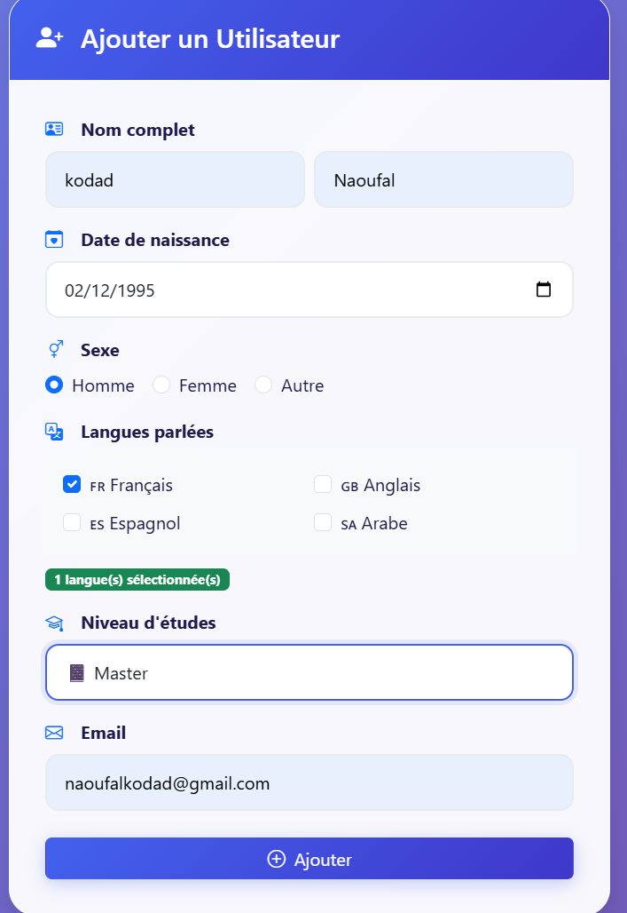
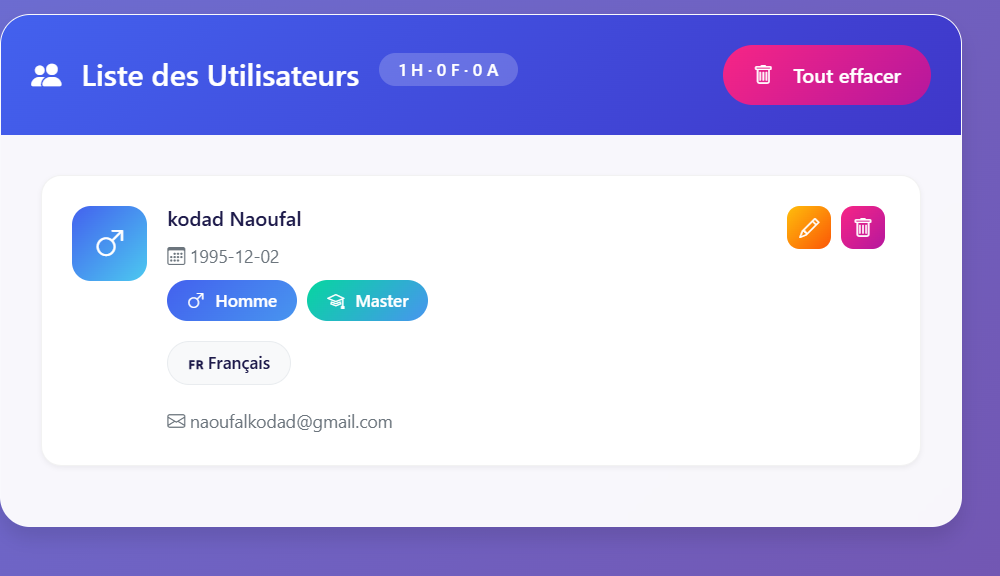
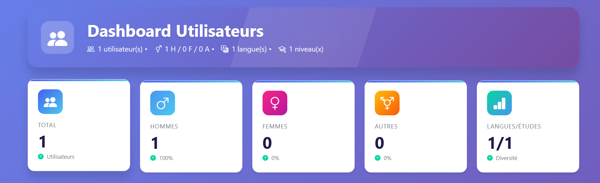

# 📊 Dashboard Utilisateurs - Application React

<div align="center">
  
  <p>
    <strong>Une application moderne de gestion d'utilisateurs avec tableau de bord interactif</strong>
  </p>
</div>

---

# 📋 Table des matières

* Fonctionnalités
* Stack Technique
* Structure du projet
* Installation
* Utilisation
* Captures d'écran
* Apprentissages
* Améliorations futures
* Auteur

---

# ✨ Fonctionnalités

## 📋 Gestion des utilisateurs (CRUD)

| Opération | Description                           |
| --------- | ------------------------------------- |
| Create    | Ajouter un utilisateur via formulaire |
| Read      | Afficher la liste des utilisateurs    |
| Update    | Modifier un utilisateur via modal     |
| Delete    | Supprimer un utilisateur              |

---

## 📊 Tableau de bord interactif

* Total des utilisateurs
* Répartition Hommes / Femmes / Autres
* Graphique circulaire
* Barres de progression
* Mise à jour en temps réel

---

## 🎨 Interface utilisateur

* Design responsive
* Animations CSS
* Badges colorés
* Modal de modification
* Messages de confirmation
* Icônes Bootstrap Icons

---

## 📝 Formulaire complet

Champs disponibles :

* Nom
* Prénom
* Date de naissance
* Sexe (Homme / Femme / Autre)
* Langues (checkbox)
* Niveau d'études
* Email avec validation

---

# 🛠️ Stack Technique

## Frontend

| Technologie     | Utilisation           |
| --------------- | --------------------- |
| React 18        | Interface utilisateur |
| Bootstrap 5     | Design responsive     |
| Bootstrap Icons | Icônes                |
| CSS3            | Animations            |

---

## Outils

* Git
* GitHub
* Vercel
* npm
* OBS Studio

---

# 📁 Structure du Projet

```
dashboard-utilisateurs

public/
 └── index.html

src/
 ├── components/
 │   ├── Dashboard.js
 │   ├── UserForm.js
 │   ├── UserList.js
 │   ├── EditUserModal.js
 │   ├── StatsCard.js
 │   └── UserAvatar.js

 ├── App.js
 ├── App.css
 └── index.js

screenshots/

.gitignore
package.json
vercel.json
README.md
```

---

# 🚀 Installation

## Prérequis

* Node.js
* npm
* Git

---

## Installation

Cloner le projet

```
git clone https://github.com/votre-utilisateur/dashboard-utilisateurs.git
```

Entrer dans le dossier

```
cd dashboard-utilisateurs
```

Installer les dépendances

```
npm install
```

Lancer l'application

```
npm start
```

Application disponible sur :

```
http://localhost:3000
```

---

# 🎯 Utilisation

## Ajouter un utilisateur

1. Remplir le formulaire
2. Choisir les informations
3. Cliquer sur **Ajouter**

---

## Modifier un utilisateur

1. Cliquer sur l’icône **✏️**
2. Modifier les informations
3. Cliquer sur **Enregistrer**

---

## Supprimer un utilisateur

* Cliquer sur **🗑️**
* Confirmation demandée

---

## Voir les statistiques

Les statistiques se mettent à jour automatiquement :

* Total utilisateurs
* Répartition par sexe
* Graphique
* Progression

---

# 📸 Captures d'écran

Ajouter dans le dossier **screenshots**

### Dashboard


### Ajouter utilisateur


### Liste utilisateurs


### Statistiques


### Modifier utilisateur


### Supprimer utilisateur


### Supprimer tous


---

# 💡 Ce que j'ai appris

## React

* useState
* useEffect
* composants
* props
* formulaires contrôlés

## Frontend

* responsive design
* animations CSS
* UI/UX

## Déploiement

* GitHub
* Vercel
* gestion des builds

---

# 🔮 Améliorations futures

## Priorité haute

* Base de données
* Authentification
* Recherche
* Pagination

## Priorité moyenne

* Export PDF
* Tests
* Mode sombre

## Priorité basse

* PWA
* Internationalisation
* WebSocket

---

# 👨‍💻 Auteur

Nom :Naoufalkodad

vercel : (https://seomaniak-test-user-dashboard.vercel.app/)

Email : Naoufalkodad@gmail.com

---

